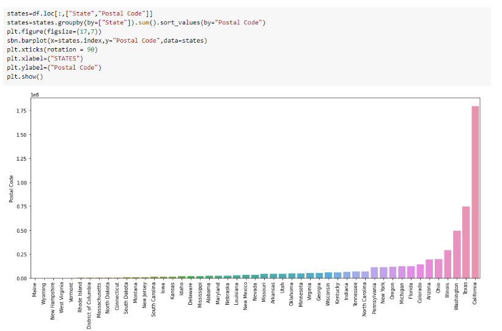

# Ex-04-Multivariate-Analysis
# AIM:
To perform Multivariate EDA on the given data set.

# EXPLANATION
Exploratory data analysis is used to understand the messages within a dataset. This technique involves many iterative processes to ensure that the cleaned data is further sorted to better understand the useful meaning.The primary aim with exploratory analysis is to examine the data for distribution, outliers and anomalies to direct specific testing of your hypothesis.
#  ALGORITHM
## STEP 1
Import the built libraries required to perform EDA and outlier removal.

## STEP 2
Read the given csv file

## STEP 3
Convert the file into a dataframe and get information of the data.

## STEP 4
Return the objects containing counts of unique values using (value_counts()).

## STEP 5
Plot the counts in the form of Histogram or Bar Graph.

## STEP 6
Use seaborn the bar graph comparison of data can be viewed.

## STEP 7
Find the pairwise correlation of all columns in the dataframe.corr()

## STEP 8
Save the final data set into the file
# CODE
```
Developed by: KRISHNA PRAKAASH D M
Registration Number:212221230052
```

```
**Multivariate EDA - SuperStore.csv**
import pandas as pd
import numpy as np
import seaborn as sbn
import matplotlib.pyplot as plt
df = pd.read_csv("SuperStore.csv")
df.head(10)
df.info()
df.describe()
df.isnull().sum()
df['Postal Code'] = df["Postal Code"].fillna(df['Postal Code'].mode()[0])
df.isnull().sum()
df.dtypes
sbn.scatterplot(df['Postal Code'],df['Sales'])
states=df.loc[:,["State","Sales"]]
states=states.groupby(by=["State"]).sum().sort_values(by="Sales")
plt.figure(figsize=(17,7))
sbn.barplot(x=states.index,y="Sales",data=states)
plt.xticks(rotation = 90)
plt.xlabel=("STATES")
plt.ylabel=("SALES")
plt.show()
states=df.loc[:,["State","Postal Code"]]
states=states.groupby(by=["State"]).sum().sort_values(by="Postal Code")
plt.figure(figsize=(17,7))
sbn.barplot(x=states.index,y="Postal Code",data=states)
plt.xticks(rotation = 90)
plt.xlabel=("STATES")
plt.ylabel=("Postal Code")
plt.show()
states=df.loc[:,["Segment","Sales"]]
states=states.groupby(by=["Segment"]).sum().sort_values(by="Sales")
#plt.figure(figsize=(10,7))
sbn.barplot(x=states.index,y="Sales",data=states)
plt.xticks(rotation = 90)
plt.xlabel=("SEGMENT")
plt.ylabel=("SALES")
plt.show()
sbn.barplot(df['Postal Code'],df['Ship Mode'],hue=df['Region'])
df.corr()
sbn.heatmap(df.corr(),annot=True)
```
# OUTPUT

## EDA - SuperStore.csv


## Displaying information about Dataset

## Checking the null values and Cleaning it


## Displaying datatypes of each features


## Multivariate Analysis - Scatterplot


## Multivariate Analysis - Barplot




## Correlation Coefficient Interpretation using HeatMap

# RESULT
Thus the program to perform EDA on the given data set is successfully executed.


